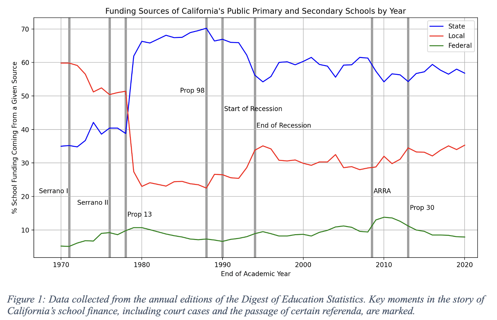
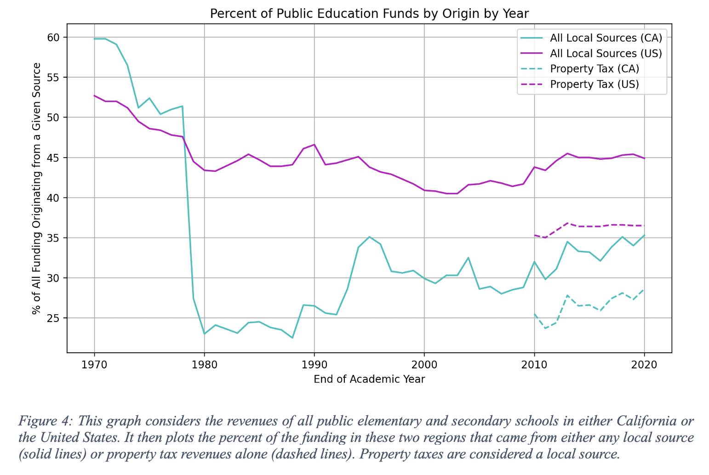
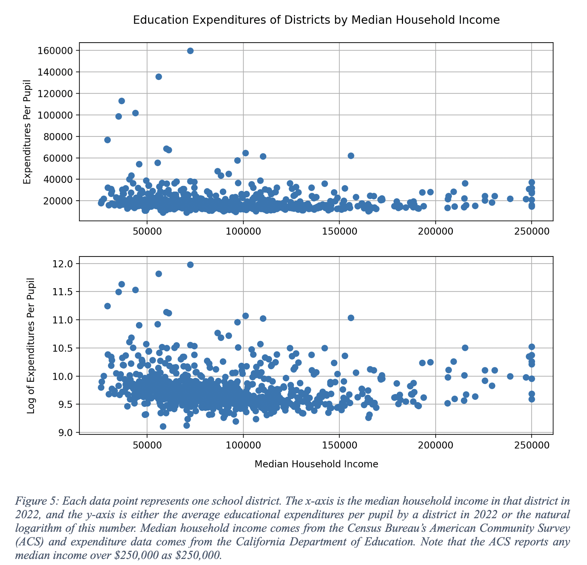

# us_education_finance

This repository makes available data on school finances (i.e., the amount of finances and the percentages of different sources that generated it) in public elementary and secondary schools in California, Texas, and the United States as a whole. Data is collected from every edition of the National Center for Education Statistics's (NCES) Digest of Education Statistics for school years ending from 1970 to 2020. As the Digest was published exclusively in print prior to 1995, this electronic dataset is first of its kind to the knowledge of the author.

Data can be imported from `school_funding_sources.py`. The data is available in a number of dictionaries that were populated by reading through the Digests. The total revenue available to region `R` (where `R` is `CA`, `TX`, or `US`) in a year `Y` is accessed by `total_funding_R[Y]`. The percentage of this funding that comes from sources at the `S`-level (where `S` is `fed`, `state`, or `local`) is `S_perc_R[Y]`. The percentage of funding that is generated by the property tax is `prop_tax_R[Y]`. The funds generated by the property tax are a subset of the funds generated by all `local` sources.

---

### Example Analyses

The other files in the repositories give some examples of figures that can be generated with this data.

From `ca_sources_graph.py`:

From `ca_vs_us_graph.py`:

From `correlation_analysis.py`:

---

Completed as part of my final research project for IAPA 1701X (American Education Policy) at Brown University.
